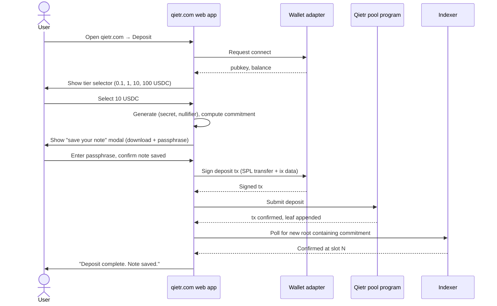
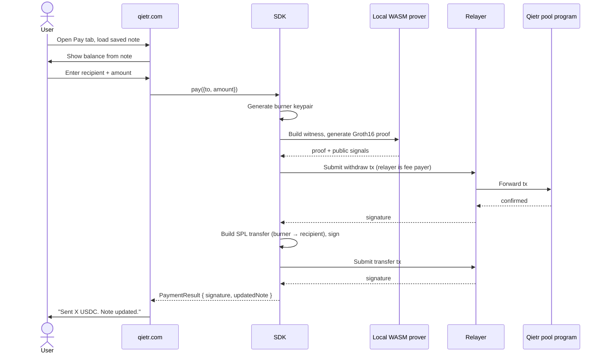

# User Workflows — Qietr

**Version:** 0.1 (spec phase)

This document describes the end-to-end flows a user, agent operator, or merchant goes through. Each flow includes happy path, edge cases, and the system components involved.

---

## 1. Personas

- **First-time depositor (FTD).** New to Qietr. Has a Solana wallet with USDC.
- **Returning user (RU).** Has a saved note, makes a payment.
- **Agent operator (AO).** Integrates the SDK into a long-running bot. Cares about latency, batch deposits, and predictable note rotation.
- **Merchant (M).** Runs an x402 endpoint. Receives ordinary USDC and is unaware Qietr is involved.

---

## 2. Flow A — First deposit (web app)

### Happy path



### Steps a user actually performs

1. Open `qietr.com`, click **Deposit**.
2. Connect a wallet. Web app shows USDC balance.
3. Choose a tier. Display the post-fee net amount and the current anonymity set for that tier.
4. Click **Save note**. A modal forces the user to either download the note file or copy the encrypted blob and confirm. The deposit button stays disabled until confirmation.
5. Click **Deposit**. Wallet popup; sign once.
6. Wait for confirmation indicator. Show estimated time (target under 30 seconds).
7. Done screen with three actions: **Make a payment**, **Deposit again**, **Back up note**.

### Edge cases

- **User refreshes during deposit.** The signed tx is still in the mempool. Web app on reload should detect a deposit-in-progress flag in `sessionStorage` and resume polling for confirmation.
- **User closes the save-note modal.** Deposit button stays disabled. The note is only generated once the user proceeds, so there is no risk of losing a note that exists on-chain but not on the device.
- **Wallet sign fails.** Show recoverable error with retry. No state change on-chain.
- **Insufficient USDC.** Disable tier selector for tiers above balance + show top-up CTA.

### Failure recovery

If the transaction confirms but the page never shows the success state (e.g. browser crash after sign):
- The commitment is on-chain.
- The user has the secret/nullifier in their downloaded note.
- On next visit, they can load the note in the **Note manager** and the SDK confirms the on-chain commitment matches.

---

## 3. Flow B — Direct payment (web app)

### Happy path



### Edge cases

- **Recipient is the user's own wallet (refund/rebalance).** Allowed but warn: it links a fresh burner to the user's wallet only at the SPL transfer step, which is the same exposure as any other recipient.
- **Amount exceeds note balance across all commitments.** Block with clear error. Future: support combining commitments in a single proof.
- **Proof generation slow (>30s) on low-end device.** Show progress UI; offer remote prover with the privacy warning.
- **Relayer rate limit hit.** SDK falls back to user-paid SOL fee path, or queues with exponential backoff.
- **Stale root.** SDK detects revert reason and re-fetches the Merkle proof + re-runs prover.

### Failure recovery

- **Withdraw confirmed but SPL transfer never broadcast.** USDC sits in the burner's token account. SDK persists `burner.privateKey` to local storage encrypted with the same passphrase as the note. On next session, the SDK detects "orphan burner" and offers to retry the transfer or sweep it back into a new deposit.

---

## 4. Flow C — Agent x402 payment (`wrapFetch`)

### Happy path

```mermaid
sequenceDiagram
    participant Agent
    participant SDK
    participant API as Merchant API (x402)
    participant Facilitator as x402-svm facilitator
    participant Pool as Qietr pool program

    Agent->>SDK: setNote(note); fetch = sdk.wrapFetch(fetch)
    Agent->>API: fetch(/expensive)
    API-->>Agent: 402 + accepts: [{amount, payTo, network: "solana", ...}]
    SDK->>SDK: Pick smallest tier ≥ amount + fees
    SDK->>SDK: Generate burner, build witness, prove
    SDK->>Pool: withdraw(proof) → burner ATA receives USDC
    SDK->>SDK: Sign x402-svm SPL transfer (burner → payTo)
    SDK->>API: Re-fetch with X-PAYMENT header (base64 signed transfer)
    API->>Facilitator: Verify + submit transfer
    Facilitator->>Merchant: USDC settles
    API-->>SDK: 200 + response body
    SDK-->>Agent: response
    Agent->>SDK: getUpdatedNote() → save
```

### Edge cases

- **API returns 402 again on retry.** Treat as merchant rejecting our payment. SDK reverts internal note state to the prior commitment if the withdraw confirmed but x402 was not accepted; surface error to caller.
- **Multiple denominations needed.** For amounts not matching any single tier, SDK chains: spend a 10-tier note for the full price; change commitment carries the remainder. Pricing must be ≤ the chosen tier value.
- **Agent restarts mid-flight.** SDK persists note + in-flight burner in encrypted state. Resume on restart.

---

## 5. Flow D — Note backup and recovery

### Happy path (backup)

1. User clicks **Back up note** in the web app.
2. Web app shows two formats:
   - **Encrypted blob** (`qietr.enc.v1:<base64>`) — paste into a password manager.
   - **Recovery phrase** (BIP-39 24 words derived from the encryption key) — for users who prefer a phrase.
3. User confirms backup by retyping a 6-character checksum displayed once.

### Happy path (recovery)

1. User opens **Restore note**.
2. Pastes encrypted blob or recovery phrase.
3. Enters passphrase (for encrypted blob).
4. SDK decrypts, verifies version and structure, queries indexer to confirm at least one commitment is still active.
5. Note loaded into session.

### Edge cases

- **Encrypted blob from a different version.** Show version-mismatch error and link to migration guide. v1 → v2 migration semantics are defined when v2 ships, not pre-emptively.
- **Recovery phrase typo.** Show "checksum failed; please verify each word" — no specific word called out (BIP-39 standard behavior).
- **All commitments already spent.** Note loads but balance is zero. User sees "this note is fully spent" and can dismiss.

---

## 6. Flow E — Deposit via SDK (agent operator, no UI)

```ts
import { QietrSDK } from "@qietr/sdk";
import { Keypair } from "@solana/web3.js";

const sdk = new QietrSDK({ cluster: "mainnet-beta" });

const payer = Keypair.fromSecretKey(/* ... */);

const note = await sdk.deposit({
  amount: 10,
  payer,
  onProgress: (stage) => console.log(stage), // "commitment-built", "tx-signed", "confirmed"
});

await saveNoteEncrypted(note, process.env.QIETR_PASSPHRASE!);
```

### Operator concerns

- **Batch deposits.** Operator wants to deposit N notes in one wallet session.
  - SDK exposes `depositBatch({ amounts, payer })` returning `Note[]`. Each note is independently spendable. Batch is N separate transactions, parallelizable, but presented as a single API call.
- **Deterministic burner generation.** Off the table by design. Burners must be unpredictable to maintain unlinkability. Operators who want recoverable burners are mis-modeling the threat.
- **Long-lived agent.** Operator runs the agent for weeks. SDK should:
  - Surface "anonymity set below X" warnings via callback.
  - Refresh Merkle proofs lazily, not eagerly.
  - Not log sensitive fields. Logger redacts `secret`, `nullifier`, `privateKey`.

---

## 7. Flow F — Merchant integration (no Qietr code)

Merchants integrate x402 normally:

```ts
// Merchant pseudocode — unchanged from standard x402
app.get("/v1/expensive", x402Middleware({
  price: { amount: "100000", asset: "USDC", network: "solana" },
  payTo: MERCHANT_PUBKEY,
}), handler);
```

Merchant receives USDC into `MERCHANT_PUBKEY`. The fact that it came from a Qietr burner is invisible at the protocol level. No Qietr SDK is required on the server.

### What the merchant sees on-chain

- A one-time Solana account transferring exactly the requested amount.
- No prior history for that account.
- A small SOL balance funded by the relayer.

This is indistinguishable from any other fresh-keypair-pays-once flow. The privacy guarantee depends on the relayer not correlating burners with depositors, which is enforced by:
- No persistent burner identifiers.
- Relayer logs minimum required for abuse detection, with hashed-IP-only retention.
- Burner pubkey is generated client-side and the relayer only sees the signed tx.

---

## 8. Flow G — Note cleanup / consolidate

Over time an agent's note may accumulate small change commitments. The web app and SDK expose a **Consolidate** action:

1. Pick a target tier (e.g. 10 USDC).
2. SDK identifies commitments whose combined value exceeds the target.
3. Generates a sequence of (withdraw + deposit) operations that nets to a single fresh commitment at the target tier.
4. Each step uses a fresh burner as the intermediate so the consolidation does not link old commitments to new ones via wallet identity.

Consolidation is *not* free of privacy cost: an observer with full graph visibility may correlate consolidation transactions if they happen rapidly. The UI must show a "wait between steps" recommendation.

---

## 9. Error message catalog

User-facing copy must avoid jargon. The error code goes to logs; the message goes to the user.

| Code | User message |
|------|--------------|
| `NOTE_INVALID` | "This note format is not recognized. Make sure you copied the full text." |
| `NOTE_DECRYPT_FAILED` | "Wrong passphrase, or the note is damaged." |
| `BALANCE_INSUFFICIENT` | "This note does not have enough balance for that payment." |
| `MERKLE_PROOF_STALE` | "Network state changed; rebuilding proof…" (auto-retry) |
| `NULLIFIER_SPENT` | "This part of the note has already been spent." |
| `PROOF_GENERATION_FAILED` | "We could not generate the privacy proof on this device. Try the remote prover, or use a different browser." |
| `RELAYER_UNAVAILABLE` | "Free network sponsor is busy. We will use your wallet's SOL instead (a few cents)." |
| `RECIPIENT_INVALID` | "That recipient address is not a valid Solana account." |
| `MERCHANT_REJECTED_PAYMENT` | "The merchant did not accept the payment. We are restoring your note balance." |

---

## 10. Latency budget (target)

| Stage | Target |
|-------|--------|
| Deposit: click → confirmed | < 30 s |
| Witness build | < 1 s |
| Proof generation (browser, modern laptop) | < 12 s |
| Withdraw tx submit → confirmed | < 5 s |
| x402 SPL transfer submit → confirmed | < 5 s |
| End-to-end: 402 → 200 via `wrapFetch` | < 25 s |

If any stage exceeds 2x its budget, the UI surfaces a "slower than usual" notice without failing.
